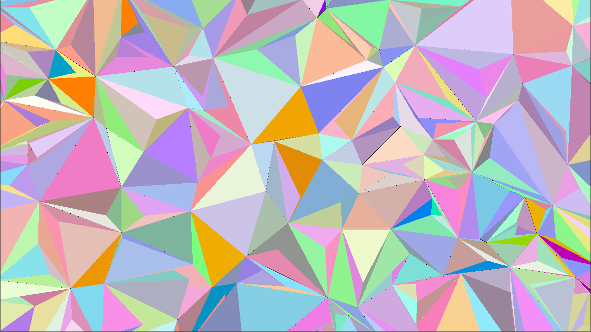
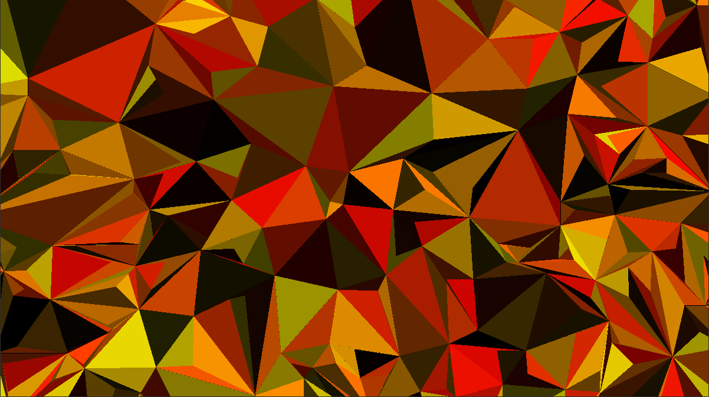
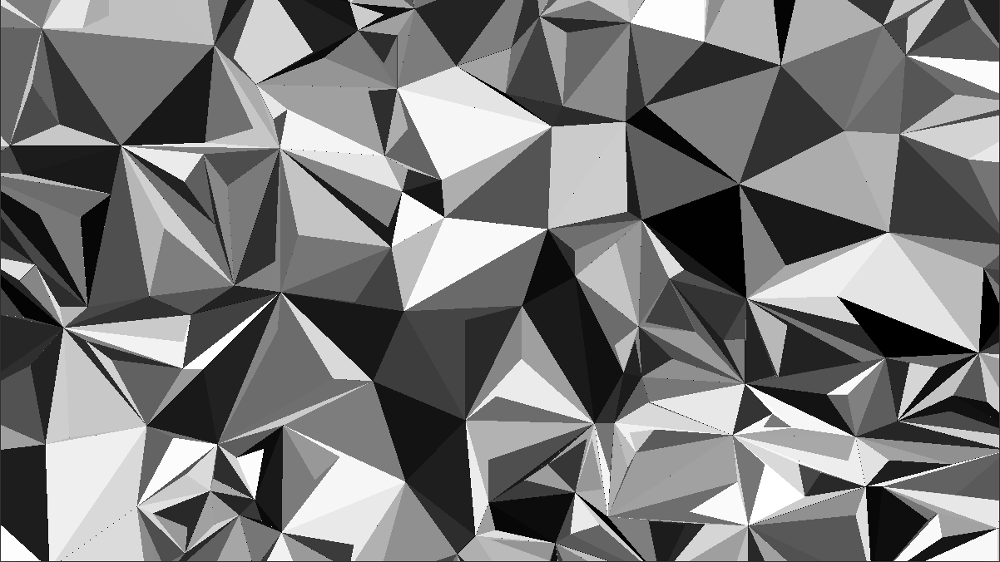

# Ubuntu 42 Wallpaper

## Overview

This little project aims to create a random triangles' mosaic, it has been inspired by the wallpaper of Ubuntu PCs screens at 42 school.

<div align="center">
  
</div>

## Prerequisites

* A Unix-based operating system (e.g., Linux, macOS)
* GCC compiler
* GNU Make

## Installation and Compilation

1. Clone this repository to your local machine:
```bash
git clone https://github.com/whazami/ubuntu-42-wallpaper.git
```
2. Navigate to the cloned repository:
```bash
cd ubuntu-42-wallpaper
```
3. Compile the project using Make:
```bash
make
```

## Usage

1. Run the executable:
```bash
./wallpaper
```
2. Enter a number between 1 and 5 to select the color palette.

## Screenshots

<div align="center">
  
  
</div>

## License

This project is licensed under the MIT License - see the [LICENSE](LICENSE) file for details.
